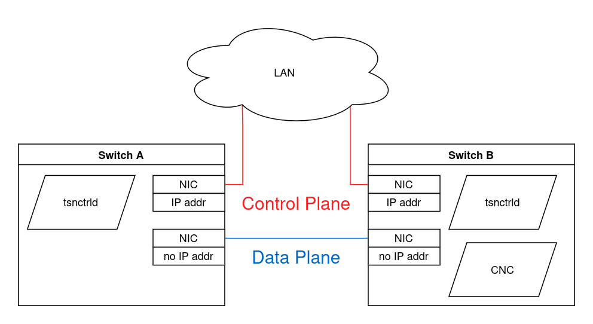

# Project demo

This demo guides you through setting up a simple scenario where there are two Debian devices connected through an Ethernet cable and there are two containers on each device, communicating through the Ethernet cable.
By using our software components, you can shape the traffic of the first device remotely from the second device.

## Basic setup



1. For the best reproducibility, install Debian 13.1 fresh on two computers and connect them directly with an Ethernet cable.
    This Ethernet cable will be on the **data plane**, where the network traffic is travelling through.
2. Also take two more cables to connect both devices to your LAN.
    Your LAN will act as the **control plane**.
3. From here on out, we will call one of the devices switch A and the other switch B.
    Decide now which is which.
4. On both switches, run `ip address show` to view the network connections.
    The network interfaces of both the control plane and the data plane have to be UP on both switches (Hint: `sudo ip link set <NIC> up`).
    Also write down the names of both switches' *data plane* NICs (network interface card, e.g. "eth0" or "enp2s0f2").
5. If the switches don't have an IP address on the *control plane* yet, assign one to each now.
   Either way, write down their control plane IP addresses.
   Don't give them IP addresses on the *data plane*!
   If there are any, they will be automatically removed later.
6. Install the `tsnctrld` as described [here](../tsnctrld/install.md) on *both* switches.
7. Install the CNC as described [here](../cnc/install.md) only on *switch B*.
8. Install Docker on *both* switches as described [here](https://docs.docker.com/engine/install/debian/).


## Creating the scenario

We will now run two Docker containers in interactive mode on each device and connect them into a TSN network.
Then we will have them send traffic to each other and create a scenario where a less important application steals the bandwith of a more important application.
Afterwards we will solve this problem with our `tsnctrld` and CNC software components!

1. Open three terminals on each switch.
   From here on out terminals A1, A2, and A3 are on switch A and terminals B1, B2, and B3 are on switch B.
   | Terminal | Location | Purpose                                 |
   | :------- | :------- | :-------------------------------------- |
   | A1       | Switch A | Switch A control                        |
   | A2       | Switch A | Send important traffic to B2            |
   | A3       | Switch A | Send **un**important traffic to B3      |
   | B1       | Switch B | Switch B control                        |
   | B2       | Switch B | Receive important traffic from A2       |
   | B3       | Switch B | Receive **un**important traffic from A3 |
2. In both terminals **A1** and **B1** navigate to root of the project repository you downloaded in the first step during installation.
3. Build our demo docker image on both switches
    ```sh
    # A1 & B1:
    sudo docker build -t tsnctrld-demo tools/project_demo/
    ```
4. Run 4 docker containers in interactive mode.
   We set the container names to `demo1` and `demo2`, make sure a container's name length doesn't exceed 9 characters!
   ```sh
   # A2 & B2:
   sudo docker run --rm -it --network=none --name demo1 tsnctrld-demo
   # A3 & B3:
   sudo docker run --rm -it --network=none --name demo2 tsnctrld-demo
   ```
5. We'll use bash scripts to automate the virtual wiring of the docker containers.
    Make sure the wiring scripts are all executable by running:
    ```sh
    # A1 & B1:
    find ./tools/virtual_wiring/ -type f -iname "*.sh" -exec chmod +x {} \;
    ```
6. Create virtual bridges on each switch and connect them to the data plane NIC of the switch
   ```sh
   # A1:
   sudo ./tools/virtual_wiring/vbridge_create.sh <DATA-PLANE-NIC>
   # B1:
   sudo ./tools/virtual_wiring/vbridge_create.sh <DATA-PLANE-NIC>
   ```
7. Connect all 4 docker containers to the virtual bridge on their switch and also assign an IP address to them.
    Keep in mind that once a docker container stops, the connection is broken and once you start it again you must use the script again to connect it:
    ```sh
    # A1:
    sudo ./tools/virtual_wiring/container_link.sh demo1 172.29.253.1/24
    sudo ./tools/virtual_wiring/container_link.sh demo2 172.29.253.2/24
    # B1:
    sudo ./tools/virtual_wiring/container_link.sh demo1 172.29.253.3/24
    sudo ./tools/virtual_wiring/container_link.sh demo2 172.29.253.4/24
    ```
8. Now start the scenario!
   Container `demo1` on switch A (terminal A2) will send important traffic to container `demo1` on switch B (terminal B2).
   Let's start with sending 1 datagram per second and the SKB priority is 3.
   ```sh
   # B2:
   ./traffic_sink
   # A2:
   ./traffic_source 172.29.253.3 1400 1 3
   ```
9. You should now see how on B2 the datagrams from A2 are received.
   Let's try to max out the bandwith between the switches:
   Increase the datagrams/sec value to 50.000 and see whether B2 can receive almost all of them.
   If it does, double the rate until you reach the maximum throughput limit and write that approximate limit down.
   ```sh
   # A2:
   ./traffic_source 172.29.253.3 1400 <DATAGRAMS-PER-SEC> 3
   ```
10. Multiply the maximum throughput with 0.6 and now run both containers on that amount of traffic.
    Also set the second container's SKB priority to 2 instead, it is less important
    ```sh
    # A2:
    ./traffic_source 172.29.253.3 1400 <60-PERC-OF-MAX> 3
    # B3:
    ./traffic_sink
    # A3:
    ./traffic_source 172.29.253.4 1400 <60-PERC-OF-MAX> 2
    ```
11. B2 and B3 combined now send more traffic than the link can support.
    You should observe that both B2 and B3 receive about the same amount of traffic, even though B2 should have priority!

------

- Terminals A1, A2, A3 are on vstsn01
- Terminals B1, B2, B3 are on vstsn02. 
- Both are on the project-demo branch with the repo's root as context
- You can switch to other branches after setup but need to switch back for teardown
- The order of executing commands is often important!

### Setup:

```sh
# A1:
sudo docker build -t tsnctrld-demo tools/project_demo/
sudo ./tools/virtual_wiring/vbridge_create.sh enp2s0f2
# A2:
sudo docker run --rm -it --network=none --name demo1 tsnctrld-demo
# A3:
sudo docker run --rm -it --network=none --name demo2 tsnctrld-demo
# A1:
sudo ./tools/virtual_wiring/container_link.sh demo1 172.29.253.1/24
sudo ./tools/virtual_wiring/container_link.sh demo2 172.29.253.2/24
# B1:
sudo docker build -t tsnctrld-demo tools/project_demo/
sudo ./tools/virtual_wiring/vbridge_create.sh enp2s0f2
# B2:
sudo docker run --rm -it --network=none --name demo1 tsnctrld-demo
# B3:
sudo docker run --rm -it --network=none --name demo2 tsnctrld-demo
# B1:
sudo ./tools/virtual_wiring/container_link.sh demo1 172.29.253.3/24
sudo ./tools/virtual_wiring/container_link.sh demo2 172.29.253.4/24
```

### Run test:

```sh
# B2:
./traffic_sink.sh
# B3:
./traffic_sink.sh
# A2:
./traffic_source 172.29.253.3 1400 50000 3
# A2:
./traffic_source 172.29.253.4 1400 50000 2
```

### Traffic shaping:

Now make sure that B2 gets all its 50.000 datagrams per sec!
Use the CNC's CLI or webinterface!
Manually you can do it this way:

```sh
# A1:
sudo tc qdisc replace dev enp2s0f2 parent root handle 100 taprio num_tc 8 map 1 0 2 3 4 5 6 7 0 0 0 0 0 0 0 0 queues 1@0 1@1 1@2 1@3 1@4 1@5 1@6 1@7 base-time 0 sched-entry S 82 100000 sched-entry S 08 1000000 sched-entry S 04 100000 clockid CLOCK_TAI
```

To remove:

```sh
# A1:
sudo tc qdisc delete dev enp2s0f2 root
```

### Teardown & Cleanup:
```sh
# A2: (stop container)
^C
exit
# A3: (stop container)
^C
exit
# B2: (stop container)
^C
exit
# B3: (stop container)
^C
exit
# A1:
sudo ./tools/virtual_wiring/container_cleanup.sh
sudo ./tools/virtual_wiring/vbridge_remove.sh
# B1:
sudo ./tools/virtual_wiring/container_cleanup.sh
sudo ./tools/virtual_wiring/vbridge_remove.sh
```
