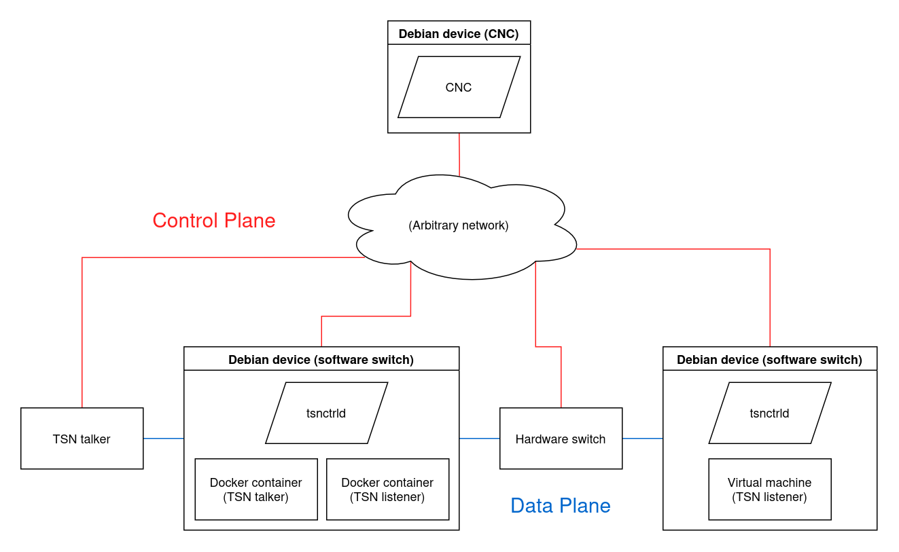

# Overview

This project allows for connecting Docker containers and virtual machines to a TSN network.
TSN is standardized by IEEE 802.1Q and facilitates real-time networking.

With our "TSN Control Daemon" (`tsnctrld`) you can turn a Debian machine into a software TSN switch, which can schedule traffic from/to hosted VMs or Docker containers using Time-Aware-Shapers defined by IEEE 802.1Qbv.
The deamon is controllable via NETCONF, allowing you to configure the `tsnctrld`'s Time-Aware-Shapers from afar with a Centralized Network Configuration unit (CNC).

Our project also includes an implementation of such a CNC, which allows you to centrally configure all Time-Aware-Shapers in your network through a webinterface or command line interface.

TSN uses two networking planes, essentialy two separate networks layered atop each other:
The first is the **data plane**, which is responsible for all the real-time application traffic regulated by the Time-Aware-Shapers.
The second is the **control plane**, which carries the NETCONF traffic for network configuration.
Each physical Ethernet cable in the network belongs to either one or the other networking plane, never both.

## Example setup

This is a simple example network to demonstrate how our software components interact.
The real-time application traffic among TSN talkers & listeners travels through the blue connections (data plane), while the Time-Aware-Shapers in that data plane are configured through NETCONF messages from the CNC, which are travelling in the red control plane.
Note that neither networking plane has to be a tree topology, cycles are allowed!
