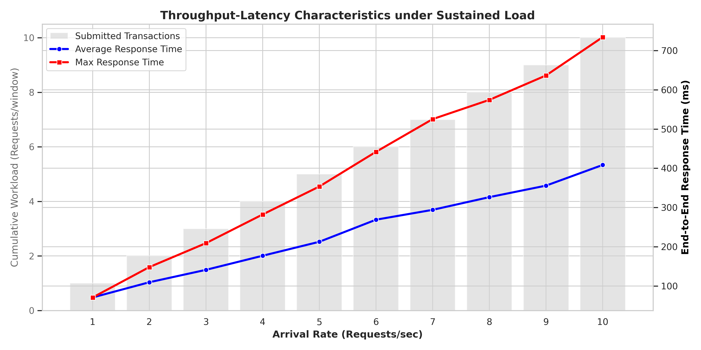
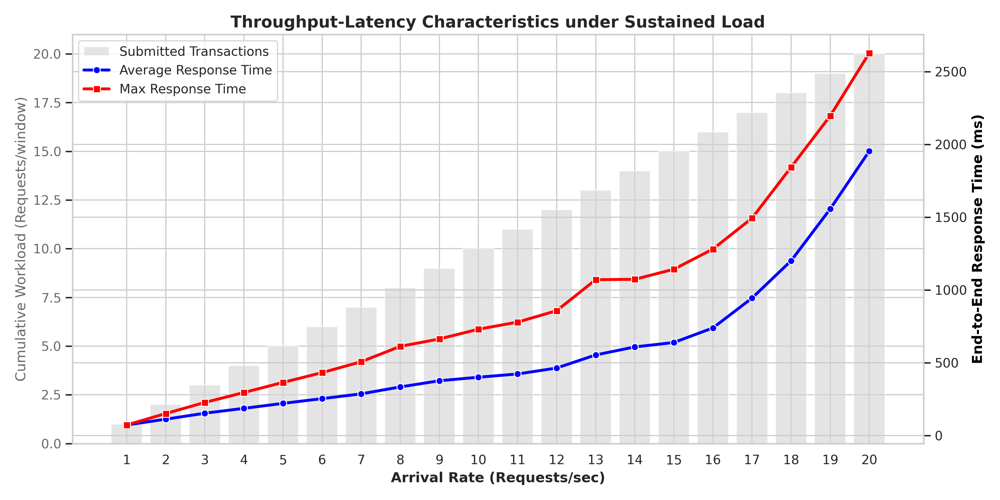
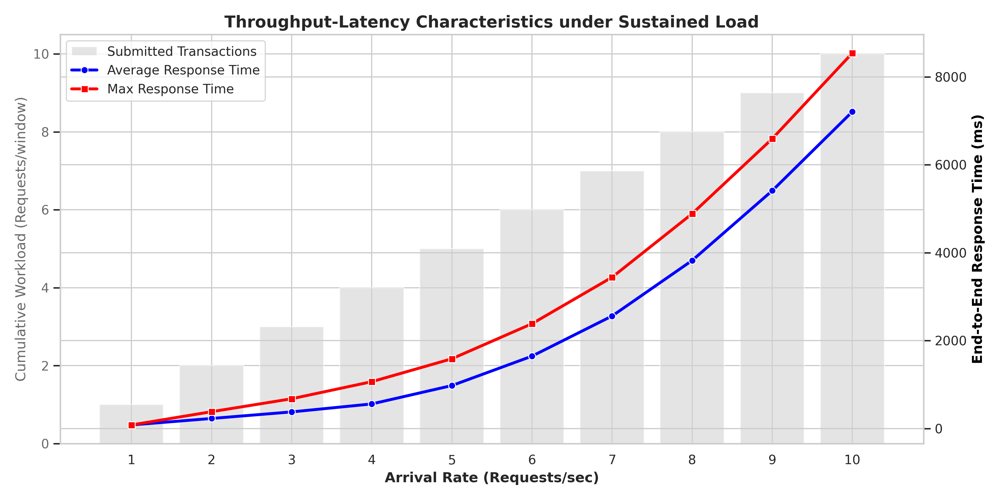
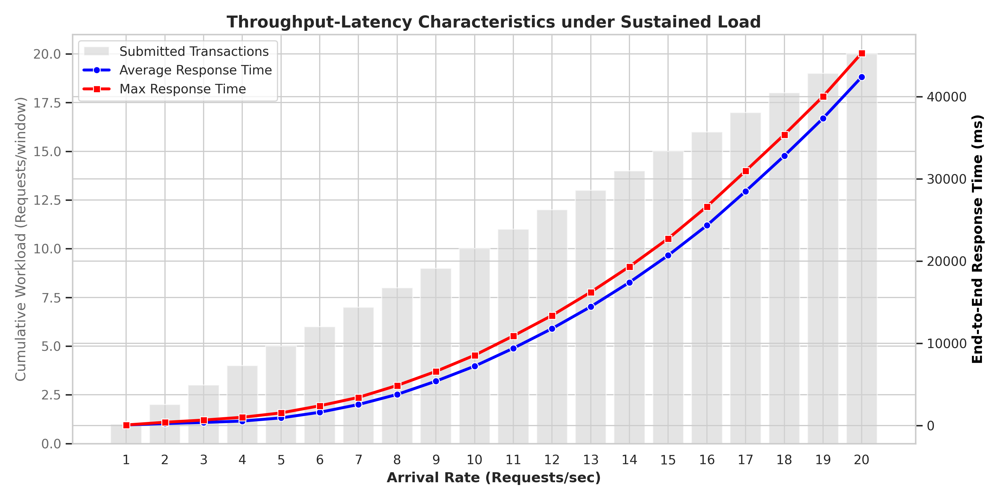
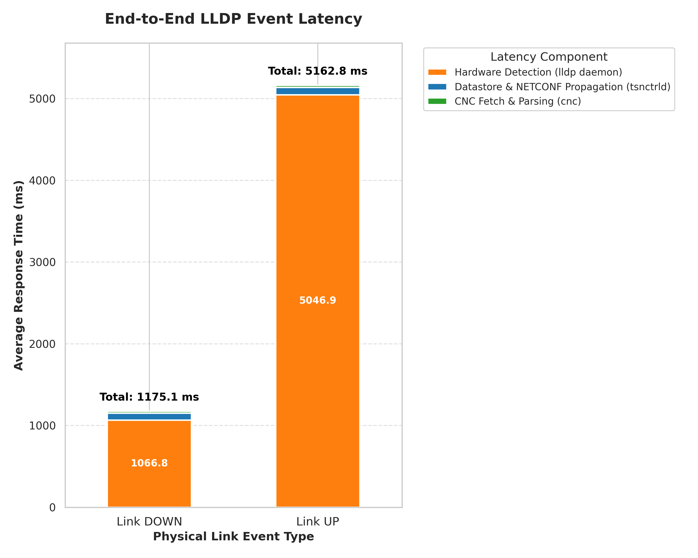
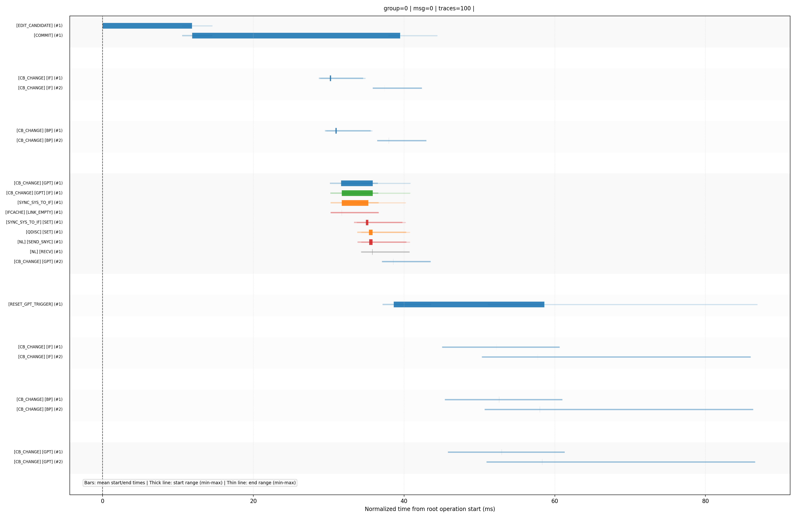


# Performance Metric Results

This section presents the empirical results derived from the performance and stress testing of the system.

The detailed methodology regarding the performance testing you can find here: [Methodology](methodology.md)

## Throughput per Second Analysis

The generated performance graphs visualize the end-to-end throughput and latency characteristics of the entire configuration pipeline under continuously escalating load. The primary objective of this test was to identify the maximum processing capacity of the system and observe the queuing behavior when this limit is exceeded.

### Target Infrastructure:
All test requests were directed at a single Time-Sensitive Networking (TSN) switch, identified as vstsn01.

### Payload and Configuration:
The workload consisted of gRPC requests instructing the CNC (Centralized Network Configuration) server to deploy an IEEE 802.1Qbv Gate Control List (GCL) schedule. Each request applied a standardized schedule configuration simultaneously across three network interfaces (enp2s0f1, enp2s0f2, and enp2s0f3). The deployed GCL template included parameters such as the administrative base time, cycle time, and an active control list defining specific gate states and time intervals.

### Varied Parameters:
The independent variable in this experiment was the Arrival Rate, measured in Requests Per Second (RPS). Instead of holding a constant load, the load generator systematically increased the arrival rate by 1 RPS every second. Specifically, the script fired 1 request during the first second, 2 requests during the second second, and continued this linear progression until a predefined ceiling (either 10 or 20 RPS) was reached.

### Measured Metrics:

Mean and Peak Response Time (Latency): The complete round-trip time. This measures the entire lifecycle from the client dispatching the gRPC request, the CNC server acquiring necessary locks, the deployment of the configuration down to the physical switch via NETCONF, and the propagation of the final result back to the client.

Failed Commits: The number of requests that were rejected or failed to apply on the hardware due to resource exhaustion or timeouts.

### Throughput 10 RPS no verification

### Throughput 20 RPS no verification

### Throughput 10 RPS with verification

### Throughput 20 RPS with verification

## End-to-End LLDP Latency
To evaluate the system's responsiveness to physical network modifications, we conducted an end-to-end latency analysis of topology change events (LLDP Link UP and DOWN). A custom load-generation script was used to toggle a physical network interface, establishing an absolute ground-truth timestamp ($T_0$). Utilizing gPTP-synchronized logs across the distributed architecture, we traced the exact lifecycle of these events through three distinct operational phases:
1. **Hardware Detection**: The time required for the local lldp daemon within the tsnctrld to recognize the physical link state change.
2. **Notification Propagation**: The duration for the internal Datastore (Sysrepo) to process the event and push a NETCONF notification to the centralized server.
3. **CNC Processing**: The time the CNC server requires to successfully fetch and parse the updated LLDP topology tree upon receiving the alert.The following decomposition illustrates the average latency anatomy for both connection establishments (UP) and disconnections (DOWN).

The DOWN commands where executed 16 times, whereas the UP commands where executed 15 times.

## Function-Level Performance Profiling

Below are the results of the function-level performance profiling.
Each function has one bar that represents its mean start and end time from the time of the start of the edit to the
candidate datastore, colors represent nesting levels and lower functions start later.

