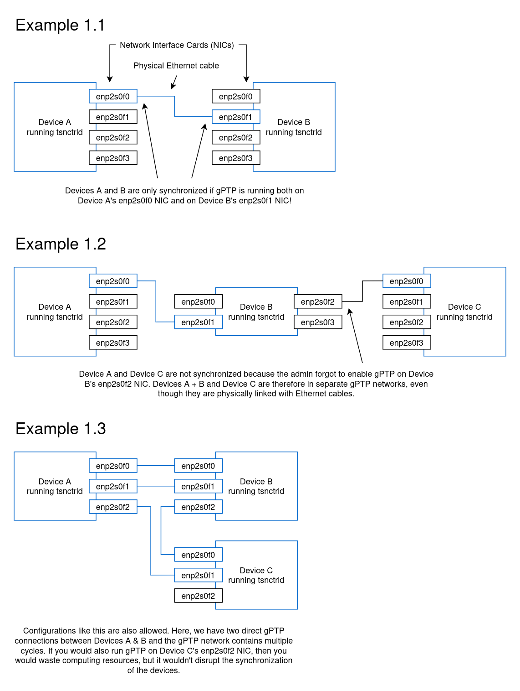

# Clock synchronization and the software switch

In a TSN network, it's essential that the clocks of all involved devices are synchronized.
A good analogy are green waves in automobile traffic:
Consecutive traffic lights are coordinated on major roads, so that when a traffic light turns green, all the traffic lights behind it also turn green just as you reach them with your car.
This way, you can drive smoothly without unnecessary pileups at each traffic light.
However, if the clocks of these traffic lights become desynchronized by several seconds, the green wave no longer works:
Green periods start too early or too late, so you have to wait at several red lights after all.

The same can happen in TSN when gate control lists become too desynchronized:
Your real-time traffic might arrive too late or forwarding queues may overflow.
But while in the traffic light example single-second-accuracy was enough, TSN requires at least microsecond-accuracy, which requires a continuous synchronization effort.

## gPTP basics
The `tsnctrld` daemon can set up clock synchronization with other devices automatically.
When it does, it uses gPTP (the Generalized Precision Time Protocol (IEEE Std 802.1AS)).
For gPTP to work properly, each device running `tsnctrld` (with gPTP) must be able to reach every other device running `tsnctrld` (with gPTP) by only travelling through physical links where the devices on both ends run gPTP on that link.

### Examples



### Setup

As you've seen in the examples above, you have to correctly specify which network interface cards (NICs) to run gPTP on, which is based on your network topology.
Every time you run `tsnctrld`, you must specify the NICs to run gPTP on via command line arguments:

```
sudo tsnctrld --nic <NIC> [<NIC> ...]
```

The `ip address show` command can list you the names of all NICs on your device, both physical and virtual.
For gPTP though, we've only tested `tsnctrld` with physical NICs.
Here are the commands you would run in the example networks from above to launch `tsnctrld` and run gPTP as shown:

```plaintext
Example 1.1
-----------
On Device A: sudo tsnctrld --nic enp2s0f0
On Device B: sudo tsnctrld --nic enp2s0f1

Example 1.2
-----------
On Device A: sudo tsnctrld --nic enp2s0f0
On Device B: sudo tsnctrld --nic enp2s0f1 enp2s0f2 (for the correct way)
On Device C: sudo tsnctrld --nic enp2s0f0

Example 1.3
-----------
On Device A: sudo tsnctrld --nic enp2s0f0 enp2s0f1 enp2s0f2
On Device B: sudo tsnctrld --nic enp2s0f0 enp2s0f1 enp2s0f2
On Device C: sudo tsnctrld --nic enp2s0f0 enp2s0f1
```

You can always declare more NICs than you actually need at the moment for the option to expand your network later without needing to restart `tsnctrld` instances.
However, if you already know that you won't do that, you might as well stay conservative to save a few computing resources.


## Synchronization strategies

For a more technical description of what the command line options named in this section do, see the [command line arguments reference](clargs.md).

### gPTP without a predefined grandmaster

This is the simplest setup and would be the strategy you use if you start the `tsnctrld` instances like in the examples above, with just the `--nic` option.
The clocks inside the TSN network would be synchronized among each other, but over time may become desynchronized compared to the world's atomic clocks, which you have to account for when using applications that use the system clock.

### gPTP with a predefined grandmaster

Same as above, but this time you select one device where you also add the `--grandmaster` flag to the command line options.
For example:

```
sudo tsnctrld --nic enp2s0f1 enp2s0f2 --grandmaster
```

While in the strategy without a predefined grandmaster the TSN devices elect a grandmaster clock among themselves, here you're explicitly selecting who the host of the grandmaster clock will be.
This is great if you already know that one of your devices has a more accurate clock than others, so you explicitly make them the grandmaster.

If your selected grandmaster becomes disconnected from the network, the other devices will elect another grandmaster clock among themselves, like without a predefined grandmaster.
You can also specify the `--grandmaster` flag on multiple devices, in which case the election takes place only among those grandmaster devices, as long as there are any left.

### gPTP disciplined with NTP

This is the most complicated setup, but it has an important advantage over the others:
As long as your selected grandmaster doesn't lose internet connection, your TSN network's clocks not only stay in sync with each other, but they also stay roughly in sync with the world's atomic clocks.
For this setup you should have only one device that you initialize with the `--grandmaster --ntp` flags.
For example:

```
sudo tsnctrld --nic enp2s0f1 enp2s0f2 --grandmaster --ntp
```

With this strategy it's important that no other device runs `tsnctrld` with the `--grandmaster` flag, since this will cause synchronization problems in your network.

### Synchronization disabled

This is for when you know what you're doing.
Instead of the `--nic`, `--grandmaster`, or `--ntp` flags, you can use the `--disable-clock-sync` flag to disable synchronization performed by `tsnctrld` on this device altogether.
Like this:

```
sudo tsnctrld --disable-clock-sync
```

The idea is that now you can set up your own clock synchronization without `tsnctrld` causing interference, because it likely will do that if you don't specify this flag.


## Further reading

Read the [command line arguments page](clargs.md) to learn more about what happens under the hood when you let `tsnctrld` handle clock synchronization.
